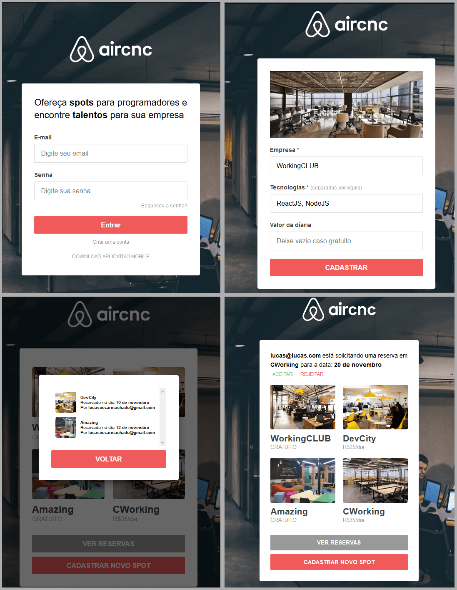
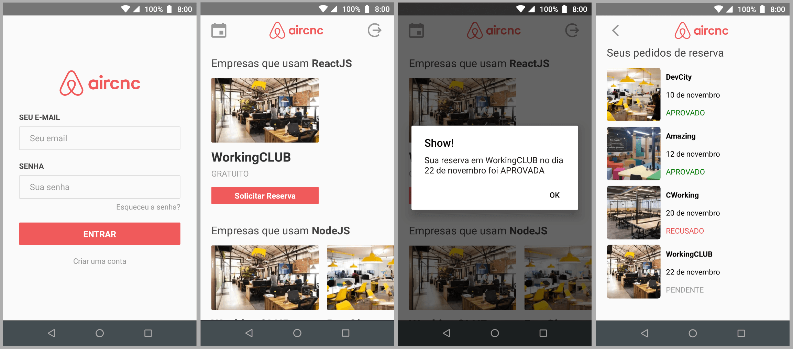

<h1 align="center">
    
</h1>

<b>Code & Coffee</b> 
Application created in rocketseat omnistack week with some more features.

  <a href="#about-this-project">About this project</a>&nbsp;&nbsp;&nbsp;&#149;&nbsp;&nbsp;&nbsp;
  <a href="#functionalities">Functionalities</a>&nbsp;&nbsp;&nbsp;&#149;&nbsp;&nbsp;&nbsp;
  <a href="#screenshots">Screenshots</a>&nbsp;&nbsp;&nbsp;&#149;&nbsp;&nbsp;&nbsp;
  <a href="#getting-started">Getting Started</a>&nbsp;&nbsp;&nbsp;&#149;&nbsp;&nbsp;&nbsp;
  <a href="#technologies">Technologies</a>

## About this project

This project is a co-working space reservation application, in which the company registers its space through a web interface and the person interested can reserve a place through the mobile application.

This project has no involvement with the Airbnb brand.

You can access the web interface <a href="https://aircnc.mybluemix.net/" target="_blank">here.</a>
And download the production android app <a href="https://github.com/Lucasczm/Omnistack-9/releases/download/latest/android-universal.apk" target="_blank">here.</a>

## Functionalities

- Login
  - Registration with email and password
  - Email Password Recovery

- Spots
  - Registration of coworking spaces
  - Image upload to IBM Cloud Object Storage
  - Scheduling coworking spaces
  - Realtime notification of scheduling request
  - Scheduling list (APPROVED, REJECT, PENDING)

## Screenshots

## Getting Started

### Backend

You need a cluster in <a href="https://www.mongodb.com/cloud/atlas">MongoDB Atlas</a>, <a href="https://sendgrid.com/">Sendgrid</a> API key, for send recover password email, and an <a href="https://cloud.ibm.com">IBM Cloud account</a>, you can use Free Lite plan, for upload images to Cloud Storage.

:exclamation: Your bucket IBM Cloud needs to be public!

In the backend folder, rename `.env.sample` to `.env` and configure the variables with your mongoDB IBM and Sendgrid API Keys. The variable `CORS` needs the address of your frontend (It's an array). The variable `FRONTEND_RECOVERY_URL` it's a frontend address for backend send an email with a redirect link.

Install all dependencies:
`$ npm install`

Run development:
`$ npm run dev`

### Frontend

In the frontend, folder rename `.env.sample` to `.env` and change the variable `REACT_APP_API_ADDRESS` to your backend address.

Install all dependences:
`$ npm install`

Run development:
`$ npm run dev`

To build production:
`$ npm run build-prd`
That's will generate your react app in the build folder

And to start the production server:
`$ npm run start`
That's will start an express static server to serve your build folder.

### Mobile

To run this project, you'll need to set up a basic environment to run a React-Native App, that can be found <a href="https://facebook.github.io/react-native/docs/getting-started">here</a>.

In the mobile folder, rename `.env.sample` to `.env` and change the variable `API_ENDPOINT` to your backend address and `FRONTEND_ENDPOINT` to your frontend address.

## Technologies

This project was developed with the following technologies:

- [IBM Cloud](https://cloud.ibm.com)
- [MongoDB](https://www.mongodb.com/)
- [Node.js](https://nodejs.org/en/)
- [React](https://reactjs.org)
- [React Native](https://facebook.github.io/react-native/)
